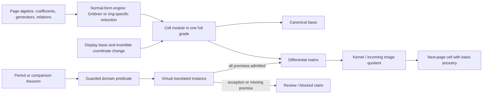

# Codex Interaction Log - 20260817T120539+0800

## Metadata

- Timestamp: 20260817T120539+0800
- Active branch: main
- Commit hash: 96f42b9ce87262e4e69cc57f4846b1b9000e471a
- Sync status: false

## Prompt

```text
You are supposed to understand the module structure of our work, as the algebraic view of each page of the spectral sequence. However, it depends on how we pick basis and how we present them at each bidegree (a cell in the visualization webpage). Thoroughly,
- Many related work mentioned "Gr\"obner basis", as a constructed basis for general quotient of certain polynomial ring, serving as a great strategy for commutative algebra (where we are now). Can that be a great tool for us?
- The HFPSS is actually NOT periodic, whereas the isomorphism with TateSS (on the upper half plane) and Slice SS (on the slope 1 cones), which are periodic by invertibility, gives some "periodicity" on HFPSS such as {g = kD^3} and {D^8 = Norm(Delta)(?)}. However, nilpotent element like v_1 deconstruct the "half-periodicity" and cause difficulties for drawing the figure/compute periodically, some called that "bo-pattern". How can the logic base of HFPSS-Studio contain this?
- Another presentation difficulty is the high-rank cell, for example, {h_1+xv_1}h_1 and {yh_2+xv_1h_1} lie in the same cell and they are already a new basis on h_1^2, yh_2, xv_1h_1. When cells like this act differentials, how do we illustrate the algebraic phenomenon? How do we kill dots? I planned to regard cells like this as a simplex, say basis is {a,b,c}; if d_r(some cycle) = {a+b}, the arrow would head to the segment (1-simplex) between dot {a} and dot {b}. Is that good?
- We are working on 2-localisation, and generally, people work on p-localisation sometimes. Make sure our tool is extendable, we can compute other spectral sequence and on other algebra in the future.
```

## Assistant Final Response

```text
Yes: Gröbner bases should become HFPSS-Studio’s **normal-form layer**; the simplex should be a **display aid only**; and “periodicity” should be represented by several typed, guarded mechanisms rather than one global copy rule. Most importantly, a cell should store a module and a differential should store a linear map—not merely dots and an arrow between dot IDs.

## 1. The mathematical object represented by one page

For a fixed page and full grading \(\gamma\), the cell should be

\[
M_r(\gamma)=E_r^\gamma,
\]

a module over the page’s coefficient ring. The page is the direct sum of these cells, with multiplication as additional structure. A differential is a homomorphism

\[
d_r:M_r(\gamma)\longrightarrow M_r(\gamma+|d_r|),
\]

represented by a matrix after bases are chosen. The next page is computed cellwise from kernels modulo incoming images. This distinction gives three separate notions that the current dot model conflates:

- **Canonical coordinates:** used for equality, computation, proofs, and serialization.
- **Display basis:** chosen for readable labels and charts; related to canonical coordinates by a recorded invertible matrix.
- **Named cycles:** expressions in either basis, with stable identities and provenance.

Thus changing the displayed basis must never change the underlying class, differential, or proof.

## 2. Gröbner bases: very useful, but only for the correct job

Suppose a page algebra has a finite presentation

\[
A_r=K[x_1,\ldots,x_n]/I_r.
\]

After fixing a monomial order, a Gröbner basis for \(I_r\) gives a deterministic normal form. The standard monomials—those not divisible by leading monomials—give canonical representatives and, in the usual field case, a basis for each finite graded piece. Module Gröbner bases similarly handle submodules, relations, and syzygies. This is exactly why Gröbner methods are useful for quotient rings and modules; crucially, the result depends on the chosen monomial order. See the official Macaulay2 explanations of [Gröbner bases](https://macaulay2.com/doc/Macaulay2/share/doc/Macaulay2/Macaulay2Doc/html/_what_spis_spa_sp__Groebner_spbasis_qu.html) and [normal forms in quotient rings](https://macaulay2.com/doc/Macaulay2/share/doc/Macaulay2/Macaulay2Doc/html/_quotient_springs.html).

What it can do for Studio:

- decide whether two polynomial expressions name the same class;
- reduce products to canonical coordinates;
- enumerate standard monomials in a bidegree;
- expose relations and compute change-of-basis vectors;
- provide a reproducible certificate containing coefficient context, generator order, monomial order, relations, and Gröbner-basis hash.

What it cannot do by itself:

- prove that a proposed differential is nonzero;
- prove permanence, naturality, or a comparison theorem;
- resolve hidden extensions;
- convert a visual pattern into a theorem.

There is also an important coefficient boundary. Over \(\mathbb F_4\), ordinary field Gröbner methods plus finite-dimensional linear algebra are natural. Over \(\mathbb Z_{(2)}\), \(W(\mathbb F_4)\), \(\mathbb Z/2^n\), or completed rings, field division is unavailable. One needs strong Gröbner/standard-basis algorithms over the relevant ring and often Smith/Hermite normal form, valuation-aware reduction, or local-ring methods. Macaulay2’s examples over [different coefficient rings](https://www.macaulay2.com/doc/OLD/Macaulay2-1.22/share/doc/Macaulay2/Macaulay2Doc/html/_simple_sp__Groebner_spbasis_spcomputations_spover_spvarious_springs.html) illustrate why the coefficient ring cannot be an afterthought.

This matches the safe boundary already present in [structured_algebra.py](</E:/课程/PACE2025_fly/HFPSS Q_8/DoodleSS/HFPSS-Studio/backend/domain/structured_algebra.py:1>) and [e2_presentation.py](</E:/课程/PACE2025_fly/HFPSS Q_8/DoodleSS/HFPSS-Studio/backend/domain/e2_presentation.py:1>): they provide explicit rewriting, but intentionally do not pretend to implement general Witt-vector arithmetic.

## 3. Periodicity should be three different objects

The phrase “periodic HFPSS” is too coarse. Studio should distinguish:

1. **Invertible period.** A proved permanent invertible class gives an actual translation isomorphism on a stated page range and grading sector. In the integer-graded \(Q_8\) calculation, \(D^8\) is the genuine 64-periodicity class. DKLLW construct this period from norm/discriminant ingredients, but a literal identity such as \(D^8=\operatorname{Norm}(\Delta)\) should remain convention-dependent until the chosen normalization is recorded. See [Duan–Kong–Li–Lu–Wang](https://arxiv.org/abs/2209.01830).

2. **Regional comparison symmetry.** An HFPSS-to-TateSS or HFPSS-to-SliceSS comparison can transport facts only where its theorem says the map is an isomorphism or detects differentials. For finite-group Tate comparison, positive-filtration agreement is a theorem with an explicit range, not permission to copy the whole chart; compare [Duan–Li–Shi](https://arxiv.org/abs/2204.08600). Store the source and target spectral sequences, grading map, page range, and a domain predicate such as “upper half-plane” or a specified cone.

3. **Pattern family.** A relation such as \(g=kD^3\), or a repeated bo-pattern, may generate expected translated motifs without supplying an invertible global action. Store its translation vector, multiplier, valid region, excluded region, known obstructions, and status. Its instances should be virtual until admitted by a proof.

Accordingly, \(D^8\)-translates may share a `period_orbit_id`, because an invertible period identifies them. Classes connected only by a \(g\)- or bo-pattern should share an `analogy_family_id`, not mathematical identity. This directly answers the “same object in the same period class” problem: exact period orbit and heuristic/restricted pattern family must be different relations.

Also, Studio should not globally declare \(v_1\) nilpotent. In the Morava \(E\)-theory coefficient ring the deformation parameter is not simply a nilpotent coefficient. What disrupts a proposed translation may instead be noninvertibility, \(v_1\)-torsion, localization behavior, or a page-specific differential. Record the exact obstruction claim attached to each pattern family rather than encoding “\(v_1\) is nilpotent” as a universal algebra rule.

Every automatically propagated differential should therefore have a proof DAG of the form

\[
\text{seed differential}
+\text{comparison/period theorem}
+\text{domain membership}
+\text{multiplier survival and nonzero status}
+\text{Leibniz/naturality}
\Longrightarrow \text{derived differential}.
\]

If one premise is absent or contradicted by a \(v_1\)-exception, the derived arrow remains `review` or `blocked`; it is not drawn as established. The current conservative split in [periodicity.py](</E:/课程/PACE2025_fly/HFPSS Q_8/DoodleSS/HFPSS-Studio/backend/domain/periodicity.py:1>)—automating sourced \(D^8\) but not the weaker \(g\)-pattern—is the right starting policy.

## 4. A high-rank cell is not literally a simplex

Your simplex idea is visually valuable, but an arrow to the geometric segment between \(a\) and \(b\) is mathematically ambiguous. Over \(\mathbb F_2\), the one-dimensional directions \([a]\), \([b]\), and \([a+b]\) are three discrete projective points; \([a+b]\) is not the midpoint of a continuum. Over \(\mathbb F_4\), a two-dimensional vector space already has five projective directions. Over a 2-local or torsion ring, submodules are more complicated still.

The better rendering is:

- show basis dots \(a,b,c\);
- create a small **combination port** labelled \(a+b\), or `[1,1,0]` in the canonical basis;
- let the arrow terminate at that port;
- optionally draw a faint simplex hull only as a coordinate mnemonic;
- on \(E_{r+1}\), render the quotient and its new basis, with ancestry back to the old cell.

If \(M=\langle a,b,c\rangle_{\mathbb F_2}\) and \(d_r(x)=a+b\), the target becomes

\[
M/\langle a+b\rangle.
\]

It does **not** kill both \(a\) and \(b\). Instead, rank drops from three to two and the quotient satisfies \([a]=[b]\); a possible next-page basis is \([a],[c]\). Over a general ring the relation is \([a]=-[b]\). More sharply, if \(d_r(x)=2a\) over a 2-local torsion coefficient ring, quotienting by \(\langle2a\rangle\) does not kill \(a\); it leaves a residue class with new torsion. Therefore “delete target dots” is not a valid general page-transition algorithm.

For your concrete cell, relative to

\[
B=(h_1^2,\; yh_2,\; xv_1h_1),
\]

the two displayed vectors are

\[
(h_1+xv_1)h_1=(1,0,1),\qquad yh_2+xv_1h_1=(0,1,1).
\]

They are two independent candidates, not yet a complete new basis of a rank-three cell. Adding \(xv_1h_1=(0,0,1)\) gives an invertible triangular transition matrix over \(\mathbb F_2\) or \(\mathbb F_4\); over a more general coefficient ring, its determinant must be a unit. All entries should first be reduced to canonical normal form because relations can change independence.

The existing [models.py](</E:/课程/PACE2025_fly/HFPSS Q_8/DoodleSS/HFPSS-Studio/backend/domain/models.py:1>) and [cell-layout.js](</E:/课程/PACE2025_fly/HFPSS Q_8/DoodleSS/HFPSS-Studio/backend/static/cell-layout.js:1>) can pack several dots, but a whole-node `ClassFate` cannot express killing the submodule \(\langle a+b\rangle\). That is the precise schema limitation to replace.

## 5. Recommended logic/data model

| Record | Mathematical responsibility |
|---|---|
| `PageAlgebra` | Coefficient backend, grading lattice, generators, homogeneous relations, monomial order, normal-form certificate |
| `CellModule` | Page and full grade, finite presentation or invariant factors, canonical basis |
| `DisplayBasis` | Human-readable vectors, labels, invertible change-of-basis matrix, provenance |
| `DifferentialMap` | Source/target cells, configured bidegree, matrix in canonical coordinates, proposition IDs |
| `PageTransition` | Kernel, incoming image, quotient presentation, basis ancestry into the next page |
| `ComparisonMap` | Two spectral sequences, page/region predicates, grading map, theorem certificate |
| `PatternFamily` | Multiplier and shift, mode (`invertible`, `regional`, or `motif`), obstruction predicate, evidence status |



This architecture makes the logic tree and the algebraic chart two views of the same records: selecting an arrow shows its matrix row/column and its premise DAG; selecting a cell shows canonical basis, display basis, relations, torsion invariants, and page ancestry.

## 6. Extension beyond the current 2-local computation

Do not hard-code arithmetic into HFPSS classes. Define a coefficient backend interface with operations such as addition, multiplication, unit test, inverse-if-unit, valuation where applicable, normal form, linear solving, kernel/image, and invariant factors. Initial implementations can progress in layers:

1. \(\mathbb F_p\) and \(\mathbb F_{p^n}\): Gröbner bases plus exact linear algebra.
2. \(\mathbb Z_{(p)}\), \(\mathbb Z/p^n\), and PIDs where applicable: Smith/Hermite methods and torsion-aware modules.
3. Witt vectors and completed local rings: precision-aware arithmetic and local standard bases.

Likewise, make the grading a configurable lattice, make the differential degree part of the spectral-sequence type, and make graded-commutativity/sign rules coefficient-aware. At odd primes, exterior behavior and Koszul signs cannot be inferred from the current characteristic-two conventions.

The safest implementation order is: first make \(\mathbb F_4\) cells module-aware and render combination ports; then compute kernel/image quotients and basis ancestry; then add guarded bo-pattern families beside the existing true \(D^8\) period; finally generalize coefficient backends. No application source was changed in this review.
```

## Git Diff Summary

Changed files:
- `.codex/CURRENT_STATE.md` (M)
- `backend/app.py` (M)
- `backend/static/app.js` (M)
- `backend/static/style.css` (M)
- `backend/templates/index.html` (M)
- `public/static/app.js` (M)
- `public/static/style.css` (M)

Diff stat:

```text
 .codex/CURRENT_STATE.md      |  30 ++++--------
 backend/app.py               |  16 +++++++
 backend/static/app.js        | 107 +++++++++++++++++++++++++++++++++++++++++--
 backend/static/style.css     |  50 ++++++++++++++++++++
 backend/templates/index.html |  17 +++++++
 public/static/app.js         | 107 +++++++++++++++++++++++++++++++++++++++++--
 public/static/style.css      |  50 ++++++++++++++++++++
 7 files changed, 345 insertions(+), 32 deletions(-)
```

## Full Git Diff

```diff
diff --git a/.codex/CURRENT_STATE.md b/.codex/CURRENT_STATE.md
index b9dae8f..f3fafa3 100644
--- a/.codex/CURRENT_STATE.md
+++ b/.codex/CURRENT_STATE.md
@@ -1,10 +1,10 @@
 # Codex Project Memory: Current State
 
-Last updated: 2026-08-11 12:28:23 +0800
+Last updated: 2026-08-12 18:30:43 +0800
 
 ## Current Project Goal
 
-- Maintain a source-backed, coefficient-aware Q8 HFPSS Studio with auditable proposition dependencies, corrected period identities, and separate computation/review surfaces.
+- Maintain a source-backed, coefficient-aware Q8 HFPSS Studio with auditable restriction, transfer, and period data.
 
 ## Active Branch
 
@@ -12,39 +12,25 @@ Last updated: 2026-08-11 12:28:23 +0800
 
 ## Recent Decisions
 
-- The REU/Overleaf audit is encoded in `REU_LATEST_FACT_CHAIN.md` and in the runtime proposition graph through `backend/domain/reu_fact_chain.py`.
-- Admit `a_{2sigma_i}=(x^2+y^2)u_{2sigma_i}=a_{sigma_i}^2`; keep the exact coefficient in `d3(u_{2sigma_i})=c x^2 h1 u` under review until a filtered topological psi-action and exact Thom normalization are independently sourced.
-- Treat the topological Galois/normalizer action as real spectrum-level structure, but do not infer exact mixed-RO transport or orientation normalization from the coefficient-field action alone.
-- Use D^8, not D^4, as the Q8-HFPSS same-object period. Interpret 16- and 32-patterns as repeated differential families.
-- The period lattice has Smith normal form `(1,2,4,4,64)` and quotient `Z/64 + Z/4 + Z/4 + Z/2`; reject the older `64,8,8,4` exercise answer.
-- `/` is computation mode and `/review` is the dedicated logic-graph/proposition-ledger mode.
-
-## Verification
-
-- New REU fact-chain tests: 2 passed.
-- New page-mode tests: 2 passed.
-- Focused interaction tests: 24 passed.
-- Full suite: 151 tests, 150 passed; one pre-existing failure remains because `backend/domain/tex_renderer.py` points to an unavailable external `2Sigma_corrected_E11above.tex` fixture.
-- Both page modes were checked in the live in-app browser; no console warnings/errors remain. JavaScript syntax, static-copy hashes, and `git diff --check` pass.
+- For C4=<i>, sigma_i restricts trivially while sigma_j and sigma_k restrict to the C4 sign representation; Thom classes must follow this grading change.
+- Use res(D)=Delta_1 only after choosing a Witt-unit normalization; Proposition A.9 fixes h1, h2, c, d, and g in DKLLW/BBHS names.
+- Do not assign canonical integral restriction formulas to the individual mod-2 2-BSS generators x and y; restrict surviving composites such as c=Dxh1 and d=D^2x^2.
 
 ## Known Issues
 
-- Restriction-based formulas may identify a target only up to a W(F4)-unit, and the chain does not construct arbitrary mixed-RO(Q8) transport.
-- The exact Thom-orientation normalization required to promote the nonzero d3 pattern to coefficient 1 is not yet independently certified.
-- The deterministic TeX-export test needs its external template source path made portable or the fixture restored.
+- Restriction-based formulas may identify a target only up to a W(F4)-unit, especially for D and Thom generators.
 
 ## Open Tasks
 
-- Attach future source-reviewed differentials and permanent cycles to the same D8 period-family metadata.
-- Independently source the filtered topological psi-action and exact Thom normalization before admitting the exact d3 coefficient.
+- If needed, construct an explicit chain-level table for x and y after fixing a specific Q8 resolution, C4 resolution, and eigenvector convention.
 
 ## Latest Log References
 
+- .codex/logs/20260812T183026+0800.md
 - .codex/logs/20260811T122823+0800.md
 - .codex/logs/20260811T111736+0800.md
 - .codex/logs/20260811T111300+0800.md
 - .codex/logs/20260811T111212+0800.md
-- .codex/logs/20260811T111024+0800.md
 
 ## Collaboration Notes
 
diff --git a/backend/app.py b/backend/app.py
index 65ad01b..f9d770e 100644
--- a/backend/app.py
+++ b/backend/app.py
@@ -32,6 +32,7 @@ from domain.dkllw_chart import (
 from domain.structured_algebra import AlgebraValidationError, preview_structured_algebra
 from domain.migrations import migrate_project
 from domain.logic_graph import build_logic_graph
+from domain.legacy_catalog import catalog_workspace_dict, manifest as legacy_catalog_manifest
 from domain.history import history_status, record_edit, redo_edit, undo_edit
 from domain.manual_periodicity import (
     ManualPeriodicityError,
@@ -174,6 +175,21 @@ def get_project():
     return jsonify(project_to_dict(load_project()))
 
 
+@app.get("/api/v2/legacy-catalog")
+def legacy_catalog():
+    return jsonify({"entries": legacy_catalog_manifest()})
+
+
+@app.get("/api/v2/legacy-catalog/<entry_id>")
+def legacy_catalog_entry(entry_id: str):
+    try:
+        return jsonify({"workspace": catalog_workspace_dict(entry_id)})
+    except KeyError:
+        return jsonify({"error": "Unknown legacy catalog entry."}), 404
+    except (FileNotFoundError, ProjectImportValidationError, json.JSONDecodeError) as error:
+        return jsonify({"error": str(error)}), 422
+
+
 @app.get("/api/project/export")
 def export_project():
     """Download the complete Studio project JSON, not a chart-only snapshot."""
diff --git a/backend/static/app.js b/backend/static/app.js
index 73c9d82..a5490ce 100644
--- a/backend/static/app.js
+++ b/backend/static/app.js
@@ -1,5 +1,8 @@
 const state = {
   project: null,
+  savedProject: null,
+  catalogEntries: [],
+  catalogMode: false,
   logicGraph: { nodes: [], edges: [] },
   history: { undo_depth: 0, redo_depth: 0, undo_label: null, redo_label: null },
   workspaceId: null,
@@ -51,6 +54,10 @@ function workspace() {
   return state.project?.workspaces.find((item) => item.id === state.workspaceId);
 }
 
+function readOnlyCatalog(ws = workspace()) {
+  return Boolean(state.catalogMode && ws?.settings?.read_only_catalog);
+}
+
 function isReferenceSupportWorkspace(item) {
   return item.spectral_sequence !== "hfpss"
     || item.group !== "Q8"
@@ -73,6 +80,15 @@ function defaultWorkspaceId() {
 
 function renderWorkspaceNavigation(ws) {
   const selector = $("#workspace-select");
+  if (readOnlyCatalog(ws)) {
+    selector.innerHTML = `<option value="${ws.id}">[read-only archive] ${escapeHtml(ws.name)}</option>`;
+    selector.value = ws.id;
+    selector.disabled = true;
+    $("#support-workspace-select").innerHTML = "";
+    $("#open-support-workspace").disabled = true;
+    return;
+  }
+  selector.disabled = false;
   const ordinary = ordinaryWorkspaces();
   const currentIsOrdinary = ordinary.some((item) => item.id === ws.id);
   selector.innerHTML = `${currentIsOrdinary ? "" : `<option value="${ws.id}">[${isReferenceSupportWorkspace(ws) ? "reference" : "atlas"}] ${escapeHtml(ws.name)}</option>`}${ordinary.map((item) => `<option value="${item.id}">${escapeHtml(item.name)}</option>`).join("")}`;
@@ -170,6 +186,8 @@ async function loadProject() {
     : null;
   const [project, history] = await Promise.all([api("/api/project"), api("/api/history")]);
   state.project = project;
+  state.catalogMode = false;
+  state.savedProject = null;
   state.history = history;
   if (!state.project.workspaces.some((item) => item.id === state.workspaceId)) state.workspaceId = defaultWorkspaceId();
   if (previousWorkspaceId === state.workspaceId && previousPage != null) {
@@ -183,6 +201,59 @@ async function loadProject() {
   render();
 }
 
+async function loadLegacyCatalogManifest() {
+  const data = await api("/api/v2/legacy-catalog");
+  state.catalogEntries = data.entries || [];
+  const selector = $("#legacy-catalog-select");
+  selector.innerHTML = state.catalogEntries.map((entry) => (
+    `<option value="${escapeHtml(entry.id)}">[${escapeHtml(entry.status)}] ${escapeHtml(entry.title)}</option>`
+  )).join("");
+  $("#open-legacy-catalog").disabled = !state.catalogEntries.length;
+}
+
+function catalogProject(project, ws) {
+  return {
+    ...project,
+    workspaces: [ws],
+    comparisons: [],
+    grading_sectors: [],
+    page_period_cycles: [],
+    drawing_periodicity_rules: [],
+    manual_periodicities: [],
+    manual_periodicity_rules: [],
+    products: [],
+  };
+}
+
+async function openLegacyCatalog() {
+  const entryId = $("#legacy-catalog-select").value;
+  if (!entryId) return;
+  const button = $("#open-legacy-catalog");
+  button.disabled = true;
+  try {
+    const data = await api(`/api/v2/legacy-catalog/${encodeURIComponent(entryId)}`);
+    if (!state.catalogMode) state.savedProject = state.project;
+    state.catalogMode = true;
+    state.project = catalogProject(state.savedProject, data.workspace);
+    state.workspaceId = data.workspace.id;
+    state.selectedClassId = null;
+    state.tool = "inspect";
+    state.connectionStart = null;
+    state.view = { zoom: 1, panX: 0, panY: 0 };
+    render();
+    toast(`Opened ${data.workspace.name} as a read-only research chart.`);
+  } catch (error) {
+    toast(error.message);
+  } finally {
+    button.disabled = false;
+  }
+}
+
+async function closeLegacyCatalog() {
+  await loadProject();
+  toast("Returned to the saved Studio project.");
+}
+
 function toolHint() {
   const hints = {
     inspect: "Select a class, or drag the canvas with the left mouse button to pan blank space. Middle-drag or Alt+left-drag pans in any tool.",
@@ -203,10 +274,29 @@ function renderPageSelector() {
   select.innerHTML = Array.from({ length: maximum - 1 }, (_, index) => {
     const page = index + 2;
     return `<option value="${page}">E${page}</option>`;
-  }).join("") + `<option value="__add_page">+ Add E${maximum + 1}</option>`;
+  }).join("") + (readOnlyCatalog(ws) ? "" : `<option value="__add_page">+ Add E${maximum + 1}</option>`);
   select.value = current;
   $("#page-previous").disabled = current <= 2;
-  $("#page-next").disabled = false;
+  $("#page-next").disabled = readOnlyCatalog(ws) && current >= maximum;
+}
+
+function renderLegacyCatalogState(ws) {
+  const entry = ws.settings.catalog_entry;
+  const active = readOnlyCatalog(ws) && entry;
+  document.body.classList.toggle("catalog-mode", Boolean(active));
+  $("#close-legacy-catalog").hidden = !active;
+  $("#legacy-catalog-summary").hidden = !active;
+  if (active) {
+    $("#legacy-catalog-select").value = entry.id;
+    const stats = entry.statistics;
+    $("#legacy-catalog-summary").innerHTML = `<strong>${escapeHtml(entry.status)} 路 ${escapeHtml(entry.authority)}</strong><span>${stats.generators} generators 路 ${stats.connections} connections 路 ${stats.differentials} differentials 路 ${stats.periodicity_rules} drawing-period rules</span><span>${escapeHtml(entry.filename)}</span><span>${escapeHtml(entry.evidence_ref)}</span><em>Read-only visual record; unlinked edges are not admitted as theorems.</em>`;
+  }
+  const blockedIds = [
+    "export-json", "export-legacy-json", "import-json", "new-workspace", "export-chart", "export-article",
+    "clear-current-canvas", "reset-demo", "run-rules",
+  ];
+  blockedIds.forEach((id) => { const node = $(`#${id}`); if (node) node.disabled = Boolean(active); });
+  document.querySelectorAll('[data-tool]:not([data-tool="inspect"])').forEach((button) => { button.disabled = Boolean(active); });
 }
 
 function render() {
@@ -217,6 +307,7 @@ function render() {
   renderWorkspaceNavigation(ws);
   renderPageSelector();
   renderHistoryControls();
+  renderLegacyCatalogState(ws);
   $("#chart").dataset.tool = state.tool;
 
   $("#workspace-title").textContent = ws.name;
@@ -242,6 +333,7 @@ function render() {
   renderPersistentPeriodicityTool();
   renderProductControls();
   renderSuggestions();
+  renderLegacyCatalogState(ws);
   constrainView();
   renderChart();
   syncLayoutHeight();
@@ -257,8 +349,8 @@ function syncLayoutHeight() {
 function renderHistoryControls() {
   const undo = $("#undo-action");
   const redo = $("#redo-action");
-  undo.disabled = !state.history.undo_depth;
-  redo.disabled = !state.history.redo_depth;
+  undo.disabled = readOnlyCatalog() || !state.history.undo_depth;
+  redo.disabled = readOnlyCatalog() || !state.history.redo_depth;
   undo.title = state.history.undo_label ? `Undo: ${state.history.undo_label} (Ctrl+Z)` : "Nothing to undo (Ctrl+Z)";
   redo.title = state.history.redo_label ? `Redo: ${state.history.redo_label} (Ctrl+Y)` : "Nothing to redo (Ctrl+Y)";
 }
@@ -1400,6 +1492,7 @@ function setPage(page) {
 
 async function extendPageLimit() {
   const ws = workspace();
+  if (readOnlyCatalog(ws)) return toast("Archived research charts are read-only.");
   const next = pageLimit(ws) + 1;
   try {
     const data = await api(`/api/workspaces/${ws.id}/settings`, { method: "PATCH", body: JSON.stringify({ page_limit: next }) });
@@ -1415,6 +1508,7 @@ async function extendPageLimit() {
 }
 
 function setTool(tool) {
+  if (readOnlyCatalog() && tool !== "inspect") return toast("Archived research charts are read-only.");
   state.tool = tool;
   state.connectionStart = null;
   state.connectionPointer = null;
@@ -1424,6 +1518,7 @@ function setTool(tool) {
 async function onClassClick(id) {
   const item = workspace().classes.find((point) => point.id === id);
   if (!item) return;
+  if (readOnlyCatalog() && state.tool !== "inspect") state.tool = "inspect";
   if (state.tool === "differential" || state.tool === "relation") {
     if (!state.connectionStart) {
       state.connectionStart = id;
@@ -1873,6 +1968,8 @@ function handleHotkey(event) {
 }
 
 function bindEvents() {
+  $("#open-legacy-catalog").addEventListener("click", openLegacyCatalog);
+  $("#close-legacy-catalog").addEventListener("click", closeLegacyCatalog);
   $("#workspace-select").addEventListener("change", (event) => {
     state.workspaceId = event.target.value;
     state.selectedClassId = null;
@@ -2111,6 +2208,6 @@ function downloadTex(kind) {
 if (PAGE_MODE === "review") bindReviewEvents();
 else bindEvents();
 
-(PAGE_MODE === "review" ? loadReviewPage() : loadProject()).catch((error) => {
+(PAGE_MODE === "review" ? loadReviewPage() : Promise.all([loadProject(), loadLegacyCatalogManifest()])).catch((error) => {
   document.body.innerHTML = `<pre>Unable to load HFPSS Studio: ${escapeHtml(error.message)}</pre>`;
 });
diff --git a/backend/static/style.css b/backend/static/style.css
index 079a116..a47fd8c 100644
--- a/backend/static/style.css
+++ b/backend/static/style.css
@@ -312,6 +312,56 @@ input {
   padding: 7px 32px 7px 9px;
 }
 
+.legacy-catalog-panel {
+  background: #f8fafc;
+  border-bottom: 1px solid var(--line);
+}
+
+.catalog-actions {
+  display: grid;
+  gap: 7px;
+  margin-top: 9px;
+}
+
+.catalog-summary {
+  display: grid;
+  gap: 5px;
+  margin-top: 10px;
+  padding: 10px;
+  border: 1px solid #bfdbfe;
+  border-radius: 6px;
+  background: #eff6ff;
+  color: #334155;
+  font-size: 12px;
+}
+
+.catalog-summary[hidden] {
+  display: none;
+}
+
+.catalog-summary strong {
+  color: #1d4ed8;
+  text-transform: uppercase;
+}
+
+.catalog-summary span,
+.catalog-summary em {
+  overflow-wrap: anywhere;
+}
+
+body.catalog-mode .chart-stage {
+  box-shadow: inset 0 3px 0 #2563eb;
+}
+
+body.catalog-mode .rules,
+body.catalog-mode .page-periodicity-section,
+body.catalog-mode .drawing-periodicity-section,
+body.catalog-mode .periodicity-section,
+body.catalog-mode .product-section,
+body.catalog-mode #find-differential-candidates {
+  display: none;
+}
+
 .top-actions {
   margin-left: auto;
   display: flex;
diff --git a/backend/templates/index.html b/backend/templates/index.html
index 364f962..0031ef3 100644
--- a/backend/templates/index.html
+++ b/backend/templates/index.html
@@ -4,6 +4,7 @@
   <meta charset="utf-8">
   <meta name="viewport" content="width=device-width, initial-scale=1">
   <title>HFPSS Studio</title>
+  <link rel="icon" href="data:,">
   <link rel="preconnect" href="https://fonts.googleapis.com">
   <link rel="preconnect" href="https://fonts.gstatic.com" crossorigin>
   <link href="https://fonts.googleapis.com/css2?family=Inter:wght@400;500;600;700&display=swap" rel="stylesheet">
@@ -61,6 +62,15 @@
 
   <main class="layout">
     <aside class="left-panel">
+      <section class="panel-section legacy-catalog-panel">
+        <div class="eyebrow">SSEQ VER15.3 ARCHIVE</div>
+        <h2>Research chart catalog</h2>
+        <p class="hint">Open any preserved REU canvas without changing the saved Studio project. Source status comes from <code>formal_notes.tex</code> first, then <code>record/note.tex</code>.</p>
+        <label>Archived canvas<select id="legacy-catalog-select" aria-label="Archived sseq ver15.3 canvas"><option value="">Loading 21 canvases...</option></select></label>
+        <div class="catalog-actions"><button type="button" id="open-legacy-catalog" class="wide">Open read-only chart</button><button type="button" id="close-legacy-catalog" class="wide" hidden>Return to saved project</button></div>
+        <div id="legacy-catalog-summary" class="catalog-summary" hidden></div>
+      </section>
+
       <section class="panel-section">
         <div class="eyebrow">COMPUTATION</div>
         <h1 id="workspace-title">Loading</h1>
@@ -87,6 +97,13 @@
         <div class="support-workspace-control"><select id="support-workspace-select" aria-label="Reference or support workspace"></select><button type="button" id="open-support-workspace">Open</button></div>
       </section>
 
+      <section class="panel-section legacy-catalog-section">
+        <div class="section-head"><div><div class="eyebrow">SSEQ VER15.3 ARCHIVE</div><h2>Research chart catalog</h2></div><span id="legacy-catalog-count" class="pill">0 / 21</span></div>
+        <p class="hint">Read-only source canvases. Historical, conflict, rejected, and review charts remain separate from the saved computation.</p>
+        <label>Chart<select id="legacy-catalog-select" aria-label="Legacy research chart"><option value="">Saved Studio computation</option></select></label>
+        <div id="legacy-catalog-meta" class="legacy-catalog-meta" aria-live="polite">Loading the catalog.</div>
+      </section>
+
       <section class="panel-section">
         <div class="section-head"><h2>Classes on this page</h2><span id="class-count" class="muted"></span></div>
         <div id="class-list" class="class-list"></div>
diff --git a/public/static/app.js b/public/static/app.js
index 73c9d82..a5490ce 100644
--- a/public/static/app.js
+++ b/public/static/app.js
@@ -1,5 +1,8 @@
 const state = {
   project: null,
+  savedProject: null,
+  catalogEntries: [],
+  catalogMode: false,
   logicGraph: { nodes: [], edges: [] },
   history: { undo_depth: 0, redo_depth: 0, undo_label: null, redo_label: null },
   workspaceId: null,
@@ -51,6 +54,10 @@ function workspace() {
   return state.project?.workspaces.find((item) => item.id === state.workspaceId);
 }
 
+function readOnlyCatalog(ws = workspace()) {
+  return Boolean(state.catalogMode && ws?.settings?.read_only_catalog);
+}
+
 function isReferenceSupportWorkspace(item) {
   return item.spectral_sequence !== "hfpss"
     || item.group !== "Q8"
@@ -73,6 +80,15 @@ function defaultWorkspaceId() {
 
 function renderWorkspaceNavigation(ws) {
   const selector = $("#workspace-select");
+  if (readOnlyCatalog(ws)) {
+    selector.innerHTML = `<option value="${ws.id}">[read-only archive] ${escapeHtml(ws.name)}</option>`;
+    selector.value = ws.id;
+    selector.disabled = true;
+    $("#support-workspace-select").innerHTML = "";
+    $("#open-support-workspace").disabled = true;
+    return;
+  }
+  selector.disabled = false;
   const ordinary = ordinaryWorkspaces();
   const currentIsOrdinary = ordinary.some((item) => item.id === ws.id);
   selector.innerHTML = `${currentIsOrdinary ? "" : `<option value="${ws.id}">[${isReferenceSupportWorkspace(ws) ? "reference" : "atlas"}] ${escapeHtml(ws.name)}</option>`}${ordinary.map((item) => `<option value="${item.id}">${escapeHtml(item.name)}</option>`).join("")}`;
@@ -170,6 +186,8 @@ async function loadProject() {
     : null;
   const [project, history] = await Promise.all([api("/api/project"), api("/api/history")]);
   state.project = project;
+  state.catalogMode = false;
+  state.savedProject = null;
   state.history = history;
   if (!state.project.workspaces.some((item) => item.id === state.workspaceId)) state.workspaceId = defaultWorkspaceId();
   if (previousWorkspaceId === state.workspaceId && previousPage != null) {
@@ -183,6 +201,59 @@ async function loadProject() {
   render();
 }
 
+async function loadLegacyCatalogManifest() {
+  const data = await api("/api/v2/legacy-catalog");
+  state.catalogEntries = data.entries || [];
+  const selector = $("#legacy-catalog-select");
+  selector.innerHTML = state.catalogEntries.map((entry) => (
+    `<option value="${escapeHtml(entry.id)}">[${escapeHtml(entry.status)}] ${escapeHtml(entry.title)}</option>`
+  )).join("");
+  $("#open-legacy-catalog").disabled = !state.catalogEntries.length;
+}
+
+function catalogProject(project, ws) {
+  return {
+    ...project,
+    workspaces: [ws],
+    comparisons: [],
+    grading_sectors: [],
+    page_period_cycles: [],
+    drawing_periodicity_rules: [],
+    manual_periodicities: [],
+    manual_periodicity_rules: [],
+    products: [],
+  };
+}
+
+async function openLegacyCatalog() {
+  const entryId = $("#legacy-catalog-select").value;
+  if (!entryId) return;
+  const button = $("#open-legacy-catalog");
+  button.disabled = true;
+  try {
+    const data = await api(`/api/v2/legacy-catalog/${encodeURIComponent(entryId)}`);
+    if (!state.catalogMode) state.savedProject = state.project;
+    state.catalogMode = true;
+    state.project = catalogProject(state.savedProject, data.workspace);
+    state.workspaceId = data.workspace.id;
+    state.selectedClassId = null;
+    state.tool = "inspect";
+    state.connectionStart = null;
+    state.view = { zoom: 1, panX: 0, panY: 0 };
+    render();
+    toast(`Opened ${data.workspace.name} as a read-only research chart.`);
+  } catch (error) {
+    toast(error.message);
+  } finally {
+    button.disabled = false;
+  }
+}
+
+async function closeLegacyCatalog() {
+  await loadProject();
+  toast("Returned to the saved Studio project.");
+}
+
 function toolHint() {
   const hints = {
     inspect: "Select a class, or drag the canvas with the left mouse button to pan blank space. Middle-drag or Alt+left-drag pans in any tool.",
@@ -203,10 +274,29 @@ function renderPageSelector() {
   select.innerHTML = Array.from({ length: maximum - 1 }, (_, index) => {
     const page = index + 2;
     return `<option value="${page}">E${page}</option>`;
-  }).join("") + `<option value="__add_page">+ Add E${maximum + 1}</option>`;
+  }).join("") + (readOnlyCatalog(ws) ? "" : `<option value="__add_page">+ Add E${maximum + 1}</option>`);
   select.value = current;
   $("#page-previous").disabled = current <= 2;
-  $("#page-next").disabled = false;
+  $("#page-next").disabled = readOnlyCatalog(ws) && current >= maximum;
+}
+
+function renderLegacyCatalogState(ws) {
+  const entry = ws.settings.catalog_entry;
+  const active = readOnlyCatalog(ws) && entry;
+  document.body.classList.toggle("catalog-mode", Boolean(active));
+  $("#close-legacy-catalog").hidden = !active;
+  $("#legacy-catalog-summary").hidden = !active;
+  if (active) {
+    $("#legacy-catalog-select").value = entry.id;
+    const stats = entry.statistics;
+    $("#legacy-catalog-summary").innerHTML = `<strong>${escapeHtml(entry.status)} 路 ${escapeHtml(entry.authority)}</strong><span>${stats.generators} generators 路 ${stats.connections} connections 路 ${stats.differentials} differentials 路 ${stats.periodicity_rules} drawing-period rules</span><span>${escapeHtml(entry.filename)}</span><span>${escapeHtml(entry.evidence_ref)}</span><em>Read-only visual record; unlinked edges are not admitted as theorems.</em>`;
+  }
+  const blockedIds = [
+    "export-json", "export-legacy-json", "import-json", "new-workspace", "export-chart", "export-article",
+    "clear-current-canvas", "reset-demo", "run-rules",
+  ];
+  blockedIds.forEach((id) => { const node = $(`#${id}`); if (node) node.disabled = Boolean(active); });
+  document.querySelectorAll('[data-tool]:not([data-tool="inspect"])').forEach((button) => { button.disabled = Boolean(active); });
 }
 
 function render() {
@@ -217,6 +307,7 @@ function render() {
   renderWorkspaceNavigation(ws);
   renderPageSelector();
   renderHistoryControls();
+  renderLegacyCatalogState(ws);
   $("#chart").dataset.tool = state.tool;
 
   $("#workspace-title").textContent = ws.name;
@@ -242,6 +333,7 @@ function render() {
   renderPersistentPeriodicityTool();
   renderProductControls();
   renderSuggestions();
+  renderLegacyCatalogState(ws);
   constrainView();
   renderChart();
   syncLayoutHeight();
@@ -257,8 +349,8 @@ function syncLayoutHeight() {
 function renderHistoryControls() {
   const undo = $("#undo-action");
   const redo = $("#redo-action");
-  undo.disabled = !state.history.undo_depth;
-  redo.disabled = !state.history.redo_depth;
+  undo.disabled = readOnlyCatalog() || !state.history.undo_depth;
+  redo.disabled = readOnlyCatalog() || !state.history.redo_depth;
   undo.title = state.history.undo_label ? `Undo: ${state.history.undo_label} (Ctrl+Z)` : "Nothing to undo (Ctrl+Z)";
   redo.title = state.history.redo_label ? `Redo: ${state.history.redo_label} (Ctrl+Y)` : "Nothing to redo (Ctrl+Y)";
 }
@@ -1400,6 +1492,7 @@ function setPage(page) {
 
 async function extendPageLimit() {
   const ws = workspace();
+  if (readOnlyCatalog(ws)) return toast("Archived research charts are read-only.");
   const next = pageLimit(ws) + 1;
   try {
     const data = await api(`/api/workspaces/${ws.id}/settings`, { method: "PATCH", body: JSON.stringify({ page_limit: next }) });
@@ -1415,6 +1508,7 @@ async function extendPageLimit() {
 }
 
 function setTool(tool) {
+  if (readOnlyCatalog() && tool !== "inspect") return toast("Archived research charts are read-only.");
   state.tool = tool;
   state.connectionStart = null;
   state.connectionPointer = null;
@@ -1424,6 +1518,7 @@ function setTool(tool) {
 async function onClassClick(id) {
   const item = workspace().classes.find((point) => point.id === id);
   if (!item) return;
+  if (readOnlyCatalog() && state.tool !== "inspect") state.tool = "inspect";
   if (state.tool === "differential" || state.tool === "relation") {
     if (!state.connectionStart) {
       state.connectionStart = id;
@@ -1873,6 +1968,8 @@ function handleHotkey(event) {
 }
 
 function bindEvents() {
+  $("#open-legacy-catalog").addEventListener("click", openLegacyCatalog);
+  $("#close-legacy-catalog").addEventListener("click", closeLegacyCatalog);
   $("#workspace-select").addEventListener("change", (event) => {
     state.workspaceId = event.target.value;
     state.selectedClassId = null;
@@ -2111,6 +2208,6 @@ function downloadTex(kind) {
 if (PAGE_MODE === "review") bindReviewEvents();
 else bindEvents();
 
-(PAGE_MODE === "review" ? loadReviewPage() : loadProject()).catch((error) => {
+(PAGE_MODE === "review" ? loadReviewPage() : Promise.all([loadProject(), loadLegacyCatalogManifest()])).catch((error) => {
   document.body.innerHTML = `<pre>Unable to load HFPSS Studio: ${escapeHtml(error.message)}</pre>`;
 });
diff --git a/public/static/style.css b/public/static/style.css
index 079a116..a47fd8c 100644
--- a/public/static/style.css
+++ b/public/static/style.css
@@ -312,6 +312,56 @@ input {
   padding: 7px 32px 7px 9px;
 }
 
+.legacy-catalog-panel {
+  background: #f8fafc;
+  border-bottom: 1px solid var(--line);
+}
+
+.catalog-actions {
+  display: grid;
+  gap: 7px;
+  margin-top: 9px;
+}
+
+.catalog-summary {
+  display: grid;
+  gap: 5px;
+  margin-top: 10px;
+  padding: 10px;
+  border: 1px solid #bfdbfe;
+  border-radius: 6px;
+  background: #eff6ff;
+  color: #334155;
+  font-size: 12px;
+}
+
+.catalog-summary[hidden] {
+  display: none;
+}
+
+.catalog-summary strong {
+  color: #1d4ed8;
+  text-transform: uppercase;
+}
+
+.catalog-summary span,
+.catalog-summary em {
+  overflow-wrap: anywhere;
+}
+
+body.catalog-mode .chart-stage {
+  box-shadow: inset 0 3px 0 #2563eb;
+}
+
+body.catalog-mode .rules,
+body.catalog-mode .page-periodicity-section,
+body.catalog-mode .drawing-periodicity-section,
+body.catalog-mode .periodicity-section,
+body.catalog-mode .product-section,
+body.catalog-mode #find-differential-candidates {
+  display: none;
+}
+
 .top-actions {
   margin-left: auto;
   display: flex;
```
