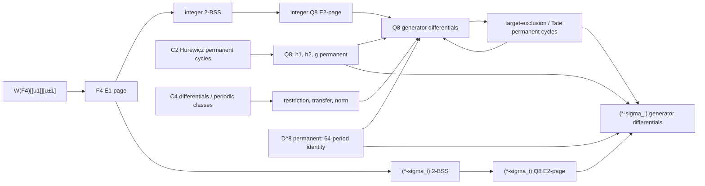

# DKLLW24 fact chain: from C2/C4 and 2-BSS to the Q8 HFPSS

This is a source-backed dependency atlas, not a formalization of every proof line.  Its terminal data have exactly two mathematical types:

- **Differential**: an asserted `d_r(source)=target` in a named spectral sequence.
- **Permanent-cycle claim**: an asserted class survives to `E_infinity` in that named spectral sequence.

Hidden extensions, restrictions, norms, vanishing lines and coefficient statements occur only as **auxiliary implication facts**.  In particular, “permanent in the 2-BSS” means “available on the Q8-HFPSS E2-page”; it does not mean permanent in the HFPSS.

## Identity and period rules

1. `D^8` is the Q8-HFPSS periodicity class.  Thus `z` and `D^(8n)z` are one period object.
2. Two table rows separated by `D^4` are generally **different anchors** inside the 64-period window.  C4's 32-periodicity may prove both, but it does not identify them as one Q8-period object.
3. On the 2-BSS/E2 input, multiplication by `D` gives the displayed `(8,0)` chart repetition.  Once HFPSS differentials begin, `D` itself is killed by `d5`; only `D^8` remains the HFPSS period identity.
4. A restriction identification such as `Res(D)=Delta1` is only up to a unit in `W(F4)` unless separately normalized.
5. The single `(*-sigma_i)` tower is not identified with arbitrary mixed `RO(Q8)` towers.

## Layer A — 2-Bockstein computation

The common input is

`H^*(Q8,F4[v1,u^-1])[D^-1][h0] => H^*(Q8,W(F4)[v1,u^-1])[D^-1]`,

where `h0` detects `2`.  Completion then gives `H^*(Q8,pi_*E2)`, the integer Q8-HFPSS E2-page.

| Datum | Type | Formula / cycle | Previous facts | What it implies | Object/period identity |
|---|---|---|---|---|---|
| `prop_chain_2bss_int_d1` | Differential, integer 2-BSS | `d1(v1^(2m+1))=2v1^(2m)h1`; `d1(Dx)=2h2^2`; `d1(x)=2y^2`; `d1(y)=2x^2` | F4 E1 algebra; Witt lift | First integral survivors and 2-torsion | All `D^n` copies are the E2 chart family, not yet HFPSS-periodic copies |
| `prop_chain_2bss_int_d2` | Differential, integer 2-BSS | `d2(v1^2)=4h2` | integer `d1` page | `h2` has order 4 | Identifies the same `h2` later named as the Hurewicz class |
| `prop_chain_2bss_int_d3` | Differential, integer 2-BSS | `d3(yh2^2)=8kD` | integer `d1,d2` pages | `k` has order 8 | `kD^n` is the same E2 multiplicative family |
| `prop_chain_2bss_int_survivors` | Permanent-cycle claim, integer 2-BSS | `k(Z/8), x^2(Z/2), y^2(Z/2), xh1(Z/2), h1(Z/2), h2(Z/4), v1^2h1(Z/2), D, v1^4` | all integer 2-BSS differentials and relations | Generates the integer Q8-HFPSS E2 input | These are 2-BSS survivors only |
| `prop_chain_2bss_sigma_d1` | Differential, twisted 2-BSS | `d1(u_sigma)=2(x+y)u_sigma`, plus its three displayed Leibniz consequences | mod-2 orientation of `sigma_i`; group cohomology | Names the four integral twisted generators | The name `(x+y)u_sigma` persists to the HFPSS and is later identified with `a_sigma` |
| `prop_chain_2bss_sigma_d2` | Differential, twisted 2-BSS | `d2(xh1^2u_sigma)=4kv1^2u_sigma` | twisted `d1`; `H^4(...tensor sigma_i)=W/4` | Hidden `h1,h2` extensions and twisted E-infinity | Same `kv1^2u_sigma` module object |
| `prop_chain_2bss_sigma_survivors` | Permanent-cycle claim, twisted 2-BSS | `(x^2+y^2)u_sigma`, `(x+y)u_sigma`, `(h1+xv1)u_sigma`, `v1^2u_sigma` | twisted `d1,d2` | Generates the `(*-sigma_i)` Q8-HFPSS E2 input | `D^n` copies are E2 chart copies; later HFPSS identity uses `D^8` |

Sources: DKLLW24 `main.tex` lines 887–1215, especially Tables 1–6.

## Layer B — C2 and C4 inputs

| Datum | Type | Formula / cycle | Previous facts | What it implies | Identity warning |
|---|---|---|---|---|---|
| `prop_chain_c2_hurewicz_pc` | Permanent-cycle claim, C2-HFPSS | the classes detecting `eta`, `nu`, `bar-kappa` | C2 Hurewicz calculation | Q8 classes `h1,h2,g` are permanent after nonzero restriction | Detection names are matched by bidegree |
| `prop_chain_c4_periodic_pc` | Permanent-cycle claim, C4-HFPSS | `Delta1^4`, `u8lambda`, `u4sigma`, `u4lambda*u2sigma` | Mackey-valued C4 computation | Normed RO(Q8) periodicities; Q8 `D^8` | C4 32-periodicity does not identify `D^4` with `1` in Q8 |
| `prop_chain_c4_d3` | Differential, C4-HFPSS | `d3(T2)!=0`; `d3(T2^3)=T2^2 eta^3` | C4 E2 algebra | twisted and integer Q8 `d3` by restriction | Restrictions determine the relevant target line |
| `prop_chain_c4_d5_delta` | Differential, C4-HFPSS | `d5(Delta1)!=0` | C4 E2 algebra | Q8 `d5(D)=D^-2gh2` | `Res(D)=Delta1` only up to a Witt unit |
| `prop_chain_c4_d5_norm` | Differential, C4-HFPSS | `d5(u2lambda)=delta1*u_lambda*a_2lambda*a_sigma` | slice differential theorem | norm-predicted twisted Q8 `d9` | Target is identified up to a unit/degree argument |
| `prop_chain_c4_d7_norm` | Differential, C4-HFPSS | `d7(u4lambda)=delta1*eta'*u2lambda*a_3lambda` | slice differential theorem | norm-predicted twisted Q8 `d13` | Same unit caveat |

The C4 stem-22 hidden `2` extension is retained as an auxiliary node (`prop_chain_c4_hidden_2`) because it forces later Q8 `d13` behavior but is neither a differential nor a permanent-cycle datum.

## Layer C — Q8 permanent-cycle backbone

| Datum | Type | Cycle | Previous facts | What it implies | Same-object rule |
|---|---|---|---|---|---|
| `prop_chain_q8_D8_pc` | Permanent-cycle claim | invertible `D^8` | norms of C4 periodic classes | 64-period propagation of every later generator fact | `z ~ D^(8n)z`; never `z ~ D^4z` merely from this fact |
| `prop_chain_q8_hurewicz_pc` | Permanent-cycle claim | `h1,h2,g=kD^3` | C2 Hurewicz permanence; integer 2-BSS names | Leibniz transport and Tate arguments | Names agree with the same E2 objects by bidegree/Hurewicz detection |
| `prop_chain_q8_usigma_pc` | Permanent-cycle claim | `(x+y)u_sigma_i=a_sigma_i` | twisted 2-BSS name; Euler-class construction | twisted `d5,d9,d23` module families | exact object identity on the single-sigma_i page |
| `prop_chain_q8_x2y2D_pc` | Permanent-cycle claim | `(x^2+y^2)D u_sigma_i` | `a_sigma_i`, integer `d9(D^6h1)`, permanent `g^2` | second twisted `d5` family and target exclusions | only its `D^8` translates are the same period object |
| `prop_chain_q8_bo_pc` | Permanent-cycle claim | `D^m v1^(4l)`, its `h1,h1^2` multiples, and `2D^m v1^(4l+2)` | Q8 `d3`; Tate method; additive norm | removes the whole bo-pattern from higher-differential searches | Parametric multiplicative family; HFPSS period identity remains `D^8` |
| `prop_chain_q8_pc_D3h1` | Permanent-cycle claim | `D^3h1` | targets already killed by `d9,d13` | integer `d23` family | `D^(8n+3)h1` is its period family |
| `prop_chain_q8_pc_Dh13` | Permanent-cycle claim | `Dh1^3` | its possible targets already support `d13,d23` | forces the hard `d7(D^4)` | `D^(8n+1)h1^3` is its period family |
| `prop_chain_q8_pc_D3dh1` | Permanent-cycle claim | `D^3dh1` | a Tate `d9` hits the corresponding class | forces `d11`, hence `d9(Dh1)` | `D^(8n+3)dh1` is its period family |
| `prop_chain_q8_pc_d` | Permanent-cycle claim | `d=D^2x^2` | Tate `d13`/Hurewicz | contradiction proof of `d9(D^2h1)` | `D^(8n)d` is its period family |
| `prop_chain_sigma_pc_hcombo` | Permanent-cycle claim | `(h1^2+xh1v1)D^r u_sigma`, `r=2,3,6,7` | target exclusion using `d23,d11` | twisted `d11,d13` forcing | four distinct anchors modulo `D^8`; `r` and `r+4` are not merged |

## Layer D — integer Q8-HFPSS differential generators

Every row below represents all `D^8` translates.  Rows separated by four powers of `D` remain distinct anchors.

| Datum | Type | Generator formulas | Principal previous facts | Can imply |
|---|---|---|---|---|
| `prop_chain_q8_d3` | Differential | `d3(D^(8n)v1^6)=D^(8n)v1^4h1^3` | C4 `d3(T2^3)`; integer 2-BSS input | integer bo permanent-cycle pattern |
| `prop_chain_q8_d5_D` | Differential | `d5(D^(8n+1))=D^(8n-2)gh2` | C4 `d5(Delta1)`; `h2,g` permanent | `d7` via hidden `2`; twisted module `d5` |
| `prop_chain_q8_d7` | Differential | `d7(4D^(8n+1))=D^(8n-2)gh1^3`; `d7(2D^(8n+2))=D^(8n-1)gh1^3`; `d7(D^(8n+4))=D^(8n+1)gh1^3` | Q8 `d5`; hidden `2`; `Dh1^3` permanent; vanishing line | completes all integer `d7` by Leibniz |
| `prop_chain_q8_d9_Dh1` | Differential | `d9(D^(8n+1)h1)=D^(8n-5)g^2c`; `d9(D^(8n+5)h1)=D^(8n-1)g^2c` | `D^3dh1` permanent; integer `d11` | twisted module `d9` |
| `prop_chain_q8_d9_D2h1` | Differential | `d9(D^(8n+2)h1)=D^(8n-4)g^2c`; `d9(D^(8n+6)h1)=D^(8n)g^2c` | `d` permanent; preceding `d9` exclusions | permanence of `(x^2+y^2)Du_sigma`; twisted `d9` |
| `prop_chain_q8_d9_c` | Differential | `d9(Dc)=D^-5g^2dh1`; `d9(D^5c)=D^-1g^2dh1`; `d9(D^2c)=D^-4g^2dh1`; `d9(D^6c)=g^2dh1` | hidden `h1`; integer `d13`; degree exclusion | permanent `D^3h1,D^3dh1`; later `d11,d9` |
| `prop_chain_q8_d11` | Differential | `d11(D^2d)=D^-4g^3h1`; `d11(D^6d)=g^3h1`; `d11(Ddh1)=D^-5g^3h1^2`; `d11(D^5dh1)=D^-1g^3h1^2` | nonzero C4 restriction; C4 32-period sibling proof; `D^3dh1` permanent | integer `d9(Dh1)`; twisted `d11` |
| `prop_chain_q8_d13` | Differential | `d13(Dch1)=2D^-8g^4`; `d13(D^5ch1)=2D^-4g^4`; `d13(2Dh2)=D^-8g^3d`; `d13(2D^5h2)=D^-4g^3d` | vanishing/transfer; C4 hidden `2`; Q8 `d5` | target exclusion; permanence of `d` and `Dh1^3` |
| `prop_chain_q8_d23` | Differential | `d23(D^-1h1)=D^-16g^6`; `d23(D^2h1^2)=D^-13g^6h1`; `d23(D^5h1^3)=D^-10g^6h1^2` | filtration-23 vanishing line; `D^3h1` permanent | twisted `d23`; target exclusion for other permanent cycles |

Sources: DKLLW24 Table 8 (`main.tex` lines 1867–1928) and its cited propositions.  The displayed coefficients inherit the paper's up-to-`W(F4)^x` convention whenever restriction is the identifying step.

## Layer E — single-`sigma_i` Q8-HFPSS differential generators

| Datum | Type | Generator formulas | Principal previous facts | Can imply / identity |
|---|---|---|---|---|
| `prop_chain_sigma_d3` | Differential | `d3((h1+xv1)u)=2kv1^2u`; `d3(v1^2u)=h1^3u` | twisted 2-BSS extensions; C4 `d3(T2)` restriction | twisted bo pattern; every `D^8` translate is the same period object |
| `prop_chain_sigma_d5` | Differential | `d5((x+y)Du)=k(yh2+xh1v1)Du`; `d5((x^2+y^2)D^2u)=kxh1^2D^2u` | integer `d5`; permanent `(x+y)u` and `(x^2+y^2)Du` | all twisted `d5` by module/Leibniz |
| `prop_chain_sigma_d9` | Differential | eight Table-9 rows: the two `(h1^2+xh1v1)D^(1,5)u`, two `(x+y)h1D^(1,5)u`, two `(x+y)D^(2,6)u`, and two `(x^2+y^2)D^(3,7)u` anchors | Tate forcing; integer `d9`; hidden `2`; C4 normed `d5` | permanent-cycle target exclusions and twisted `d11`; each exponent has its own residue modulo 8 |
| `prop_chain_sigma_d11` | Differential | four `x^2h1D^(2,3,6,7)u` rows and two `x^3D^(4,8)u` rows | permanent `(h1^2+xh1v1)D^(2,3,6,7)u`; vanishing line; module structure | completes all twisted `d11` |
| `prop_chain_sigma_d13` | Differential | `d13((x+y)D^4u)=k^3(h1^2+xh1v1)D^5u` | C4 normed `d7` or vanishing line; target permanent cycle | completes all twisted `d13` by permanent multipliers |
| `prop_chain_sigma_d17` | Differential | `d17((h1^2+xh1v1)u)=k^4(x+y)h1^2D^2u` | filtration-23 vanishing line; integer/twisted target exclusions | removes the remaining base anchor before E23 |
| `prop_chain_sigma_d23` | Differential | `d23((x+y)h1^2D^2u)=k^6(x+y)h1D^5u`; `d23((x+y)h1D^7u)=k^6(x+y)D^10u` | integer `d23` multiplied by permanent `a_sigma=(x+y)u` | completes all twisted `d23` |

Here `u=u_sigma_i`.  Full source formulas are DKLLW24 Table 9 (`main.tex` lines 2410–2475).  No row authorizes a Galois reflection or an `S3` identification of arbitrary mixed `RO(Q8)` towers.

## Reading one datum

For example, `prop_chain_sigma_d13` reads as follows:

- **Type:** differential in the `(*-sigma_i)` Q8-HFPSS.
- **Claim:** `d13((x+y)D^4u_sigma_i)=k^3(h1^2+xh1v1)D^5u_sigma_i`.
- **Previous facts:** C4 `d7(u4lambda)`, the norm-differential theorem, nonzero restriction of the normed target, the `D^8` period certificate, and the target permanent-cycle claim.
- **Can imply:** every `D^(8n)` translate and every Leibniz multiple by an admitted permanent cycle.
- **Object identity:** `D^(8n+4)(x+y)u_sigma_i` is one period object.  The `D^0` anchor is not the same Q8-period object because the shift is `D^4`, not `D^8`.

The Studio stores these records in `backend/domain/dkllw_fact_chain.py`.  Its reverse dependency field (`implies_ids`) is calculated from the premise edges, so both “what this uses” and “what this can imply” are visible in the proposition graph.
