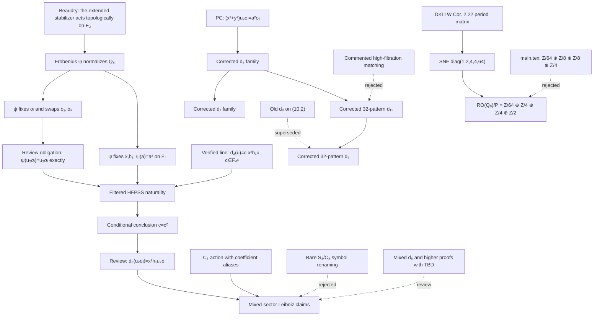

# Latest REU fact chain: corrected \(Q_8\)-HFPSS dependencies

This is the review layer between the current Overleaf project at
`E:\课程\PACE2025_fly\HFPSS Q_8\REU projects` and the source-backed
proposition graph in HFPSS Studio. It supplements
[`PREVIOUS_WORK_COLLECTION.md`](PREVIOUS_WORK_COLLECTION.md); it does not
promote every displayed formula in the research notes to a theorem.

## Admission policy

- **Admitted**: the statement, coefficient convention, and every premise edge
  have been checked.
- **Verified pattern / unit review**: non-vanishing and the differential family
  are checked, but an exact \(\mathbb F_4^\times\) or
  \(W(\mathbb F_4)^\times\) coefficient is not.
- **Review**: the proof has a `[TBD]`, an unproved orientation normalization,
  an up-to-unit ambiguity, or a dependency on a corrected argument.
- **Rejected**: a later correction or exact computation contradicts the claim.
  A rejected node cannot be a premise of an admitted descendant.

## Danus-style proposition ledger

| Fact id | Statement | Direct premises | Status | Source and audit note |
| --- | --- | --- | --- | --- |
| `reu-topological-galois` | \(G_C=S_C\rtimes\operatorname{Gal}(\mathbb F_4/\mathbb F_2)\) acts topologically on Morava \(E_2\). | Goerss--Hopkins--Miller realization; Beaudry's extended-stabilizer setup. | Admitted | Beaudry 2017. This is where the “topological” action comes from. |
| `reu-psi-q8` | Frobenius sends \(i,j,k\) to \(-i,-k,-j\). | `reu-topological-galois`; Beaudry's curve automorphisms; \(\zeta\mapsto\zeta^2\). | Admitted | Direct substitution. The central minus signs omitted in `coefficientpuzzle.tex` lines 32--37 must be restored. |
| `reu-psi-representations` | \(\psi(\sigma_i)=\sigma_i\), \(\psi(\sigma_j)=\sigma_k\), \(\psi(\sigma_k)=\sigma_j\). | `reu-psi-q8`; the central element acts trivially in 1-dimensional quotient representations. | Admitted | This is the representation-level content of the unsigned formulas in `coefficientpuzzle.tex`. |
| `reu-galois-generators` | \(x\) and \(h_1=\eta\) are Galois invariant; \(a\in\mathbb F_4\) is sent to \(a^2\). | Beaudry's invariant-generator statement; DKLLW's Hurewicz names. | Admitted | Beaudry 2017 and DKLLW24. |
| `reu-thom-normalization` | The chosen generator satisfies \(\psi(u_{2\sigma_i})=u_{2\sigma_i}\) exactly. | `reu-psi-representations`; a compatible choice and proof of the orientation generator. | Review | Fixing the representation does not automatically fix a selected Thom generator without a unit. |
| `reu-a2sigma-pc` | \(a_{2\sigma_i}=(x^2+y^2)u_{2\sigma_i}=a_{\sigma_i}^2\) is a permanent cycle. | Permanence of \(a_{\sigma_i}\); multiplicativity. | Admitted | `formal_notes.tex` lines 280, 299--304; Dec. 30 correction in `record/note.tex` around line 1267. Supersedes \(x^2u_{2\sigma_i}\). |
| `reu-d3-nonzero-line` | \(d_3(u_{2\sigma_i})=c\,x^2h_1u_{2\sigma_i}\), \(c\in\mathbb F_4^\times\). | `reu-a2sigma-pc`; \(C_4\) restriction is a 5-cycle; integer \(d_5(y^2)\); degree uniqueness. | Verified pattern / unit review | `formal_notes.tex` lines 283--305; corrected chart `Drawing/2Sigma_E3.tex` lines 340--357 corroborates locations only. |
| `reu-d3-unit` | \(d_3(u_{2\sigma_i})=x^2h_1u_{2\sigma_i}\). | `reu-d3-nonzero-line`, `reu-galois-generators`, `reu-thom-normalization`, filtered HFPSS naturality. | Review | `coefficientpuzzle.tex` lines 15--58 proves \(c=1\) only after those topology and normalization premises. |
| `reu-d5-a2sigma` | The two \((x^2+y^2)\)-families have the corrected \(d_5\) behavior. | `reu-a2sigma-pc`; integer \(d_5(D)\), \(d_5(D^2)\); Leibniz. | Admitted | `formal_notes.tex` lines 334--353. |
| `reu-d5-h2` | \(d_5(h_2D u)=k h_2^2D u\), with its 16-pattern. | Named \(C_4\) \(d_5\); nonzero restriction. | Verified pattern / unit review | `formal_notes.tex` lines 357--379. Restriction does not fix a \(W(\mathbb F_4)^\times\)-unit. |
| `reu-d5-2D` | \(d_5(2Du)=2kh_2Du\), with its 16-pattern. | Transfer/orientation calculation. | Review | `formal_notes.tex` lines 382--399 contains an unresolved annotation about the transfer coefficient. |
| `reu-d5-xh1` | \(d_5(xh_1u)=kh_1^3u\). | A transfer-permanence step. | Rejected proof / review claim | `formal_notes.tex` lines 401--420 itself questions the key transfer inference. |
| `reu-d11-corrected` | The \((x^2+y^2)D^2u\) and \(D^6u\) \(d_{11}\)'s form a corrected 32-pattern. | Corrected restriction computation, not the rejected earlier restriction lemma. | Verified pattern / unit review | `formal_notes.tex` lines 450--470; dated correction says the \(d_{11}\) is right and 32-periodic. |
| `reu-d9-corrected` | \(d_9(h_2D^2u)=h_1^2k^2D^3u\), with its 32-pattern. | `reu-d11-corrected`; vanishing/degree; \(D^{-1}h_1\) \(d_{23}\). | Verified pattern / unit review | `formal_notes.tex` lines 520--526 and Dec. correction. Supersedes the old \(d_9\) on \((10,2)\), which is a 21-cycle. |
| `reu-d7-corrected` | \(d_7(h_1Du)=2k^2D^2u\); with its shifted sibling it forms a 16-pattern. | \(C_4\)-transfer bound; corrected permanent-cycle exclusions. | Admitted pattern | `formal_notes.tex` lines 508--518; dated correction retains the \((9,1)\) \(d_7\). |
| `reu-d13-a2sigma` | The displayed \(d_{13}\) on \((x^2+y^2)D^4u\) is a Leibniz consequence. | Single-\(\sigma_i\) \(d_{13}\); `reu-a2sigma-pc`; product aliases. | Verified pattern / unit review | `formal_notes.tex` lines 540--555. |
| `reu-d21-review` | The displayed \(d_{21}\) family is forced by uniqueness. | `reu-a2sigma-pc`; \(g=kD^3\), \(D^8\) permanence; vanishing line; complete source check. | Review | `formal_notes.tex` lines 558--577; the “only source” assertion needs chart verification. |
| `reu-3sigma-descendants` | The corrected \((*-3\sigma_i)\) \(d_3,d_5,d_9,d_{11}\) patterns follow from the corrected \(2\sigma_i\) spine. | Relevant nodes above plus dated corrections. | Mixed admitted/review | `formal_notes.tex` lines 678--791. Exact units inherit review; the empty \(d_{11}\) proof cannot stand alone. |
| `reu-mixed-sector-guard` | \(\sigma_i+2\sigma_j\) and \(2\sigma_i+\sigma_j\) are not identified by \(C_3\) and periods. | Explicit orbit calculation; dated correction. | Admitted negative fact | `record/note.tex` lines 1081--1087 and April warning around lines 1344--1348. |
| `reu-mixed-formulas` | The exact mixed formulas in `formal_notes.tex` lines 811--920 hold. | Exact transported aliases; all cited auxiliary differential and permanent-cycle claims. | Review | Proofs use \(\zeta\)-sensitive transport, several `[TBD]` premises, and one invalid use of \(D^4\) as a \(Q_8\)-period identity. |
| `reu-s3-pagewise-transport` | A bare semilinear \(S_3\) action gives exact pagewise mixed-\(RO(Q_8)\) transport and \(\tau(D)=-\zeta^2D\). | Independently constructed filtered normalizer action and exact aliases. | Review | `record/note.tex` lines 1034--1077 exceeds integer Witt base change and cannot bypass `reu-mixed-sector-guard`. |
| `reu-rejected-transfer-lemma` | The “not in transfer” lemma can support descendants. | Internally claims both \(E_\infty\)-survival and a \(d_{13}\). | Rejected | `formal_notes.tex` lines 435--446. |
| `reu-rejected-high-filtration-block` | The commented matching branch can support descendants. | The source introduces it with “Seems to be wrong”. | Rejected | `formal_notes.tex` lines 579--673. |
| `reu-period-relations` | The ten norm-derived period vectors are the rows in `charts.tex`. | DKLLW24 Corollary 2.22 and norm-periodicity input. | Admitted | DKLLW24 `main.tex` lines 831--866; REU `charts.tex` lines 127--145. |
| `reu-period-snf` | The period matrix has Smith diagonal \(1,2,4,4,64\). | `reu-period-relations`; exact integer row/column operations. | Verified computation | Independently recomputed with exact integer Smith normal form. |
| `reu-period-quotient` | \(RO(Q_8)/P\cong\mathbb Z/64\oplus\mathbb Z/4\oplus\mathbb Z/4\oplus\mathbb Z/2\). | `reu-period-snf`. | Admitted | Agrees with `formal_notes.tex` line 243 and `charts.tex` lines 127--146. |
| `reu-main-period-exercise` | The exercise claiming \(\mathbb Z/64\oplus\mathbb Z/8\oplus\mathbb Z/8\oplus\mathbb Z/4\) is correct. | Would require a different Smith diagonal. | Rejected | `REU projects/main.tex` lines 104--110 is contradicted by the exact SNF. |

## Exact coefficient argument, with every premise exposed

Assume the verified nonzero line

\[
d_3(u_{2\sigma_i})=c\,x^2h_1u_{2\sigma_i},\qquad
c\in\mathbb F_4^\times.
\]

If the filtered normalizer action and exact Thom normalization are separately
certified, then HFPSS naturality gives

\[
\begin{aligned}
d_3(u_{2\sigma_i})
 &=d_3(\psi u_{2\sigma_i})
  =\psi\bigl(d_3(u_{2\sigma_i})\bigr)\\
 &=\psi(c)x^2h_1u_{2\sigma_i}
  =c^2x^2h_1u_{2\sigma_i}.
\end{aligned}
\]

Thus \(c=c^2\). Since \(c\ne0\), the only Frobenius-fixed possibility is
\(c=1\). Topology supplies filtered naturality; algebra supplies the
Frobenius equation. The proof is sharp but remains a review node until the
exact Thom normalization is certified.

## Period and object-identity rules

1. On the 2-BSS/\(E_2\) input, \(D^n\) records chart repetition only.
2. On \(E_3\), an “8-periodic” \(d_3\) family can be transported by the
   \(3\)-cycle \(D\); that does not make \(D\) an \(E_\infty\) identity.
3. The 16- and 32-patterns above are repeated differential families, not
   same-object declarations.
4. Only \(D^8\) is the permanent \(Q_8\)-HFPSS integer period. Hence
   \(z\) and \(D^{8n}z\) are one period object; \(D^4\)-separated siblings
   remain distinct anchors.

## Hard supersessions

- Replace \(x^2u_{2\sigma_i}\) by
  \((x^2+y^2)u_{2\sigma_i}=a_{\sigma_i}^2\).
- Replace the old \(d_9/d_{11}\) 16-period assertions by corrected 32-patterns.
- Reject the old \(d_9\) on \((10,2)\).
- Reject descendants relying only on `formal_notes.tex` lines 435--446 or
  the commented lines 579--673.
- Keep old Sections 6.5--6.6 rejected until individually re-proved from the
  corrected \(C_3\)-alias convention.
- Keep the \(\mathbb H\)-page “\(20+\mathbb H\) period” proof in review: it
  uses Tate invertibility of \(g\) as though it were HFPSS invertibility.

## Safe consequences for further HFPSS work

- A 2-BSS survivor is an HFPSS \(E_2\)-input, not an HFPSS permanent cycle.
- Normalizer transport requires the representation action, scalar
  semilinearity, filtered naturality, and exact class aliases.
- A transported \(j\)- or \(k\)-sector formula can acquire \(\zeta\) or
  \(\zeta^2\); typography alone does not identify classes.
- Corrected chart files corroborate coordinates and arrow locations only.
  They do not settle aliases, exact units, or proof admission.

